Ten-plus years keeping enterprise environments running, and keeping them defensible while they run. Most recently Operations Manager at Beyondsoft Consulting, embedded with Toyota Motor North America for five years. Before that: security analyst, systems administrator, and the person who got paged.

### What I bring to the table

- Incident, problem, and change management across cloud and on-prem
- SIEM engineering, alert triage, and the runbooks that make 2 a.m. survivable
- Identity and access: Entra ID, MFA policy, onboarding and offboarding, access reviews across AD, Entra ID, and AWS IAM
- Vulnerability remediation and control testing against real frameworks
- Explaining the same finding to an engineer, an auditor, and an executive, three different ways

### What's cooking

|   |   |
|---|---|
| 🍳 | **CISSP.** Target November 2026. The experience requirement is met; what's left is the exam |
| 🍳 | **CyberDefenders CCDL1.** In progress. Hands-on blue team defense, detection, and triage |
| 🍲 | **Blue team home lab.** Proxmox, Elastic Security, Sysmon + Elastic Defend, Qualys, Ansible. Documented as I go |

### On the menu here

- **[`site`](https://github.com/labwithchristian/site)** · source for [christiancarrasco.dev](https://christiancarrasco.dev). Hugo, Blowfish, GitHub Actions, and more custom CSS than I'd like to admit
- **`homelab`** *(coming soon)* · sanitized playbooks, Sysmon config, detection rules, and a CIS Controls v8 mapping

### Find me

[christiancarrasco.dev](https://christiancarrasco.dev) &nbsp;·&nbsp; [LinkedIn](https://linkedin.com/in/cybercc) &nbsp;·&nbsp; [CTF record](https://christiancarrasco.dev/ctf/)

Se habla español.
